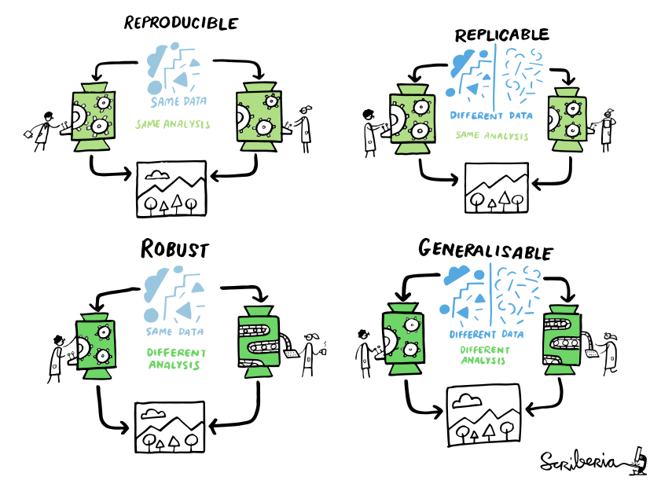
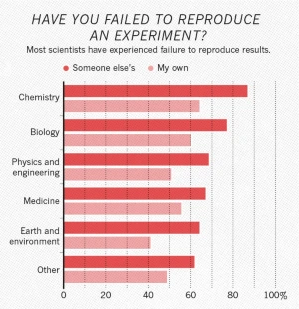
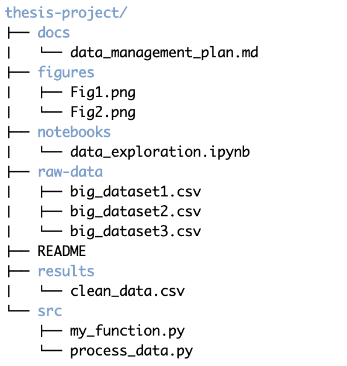

## What is reproducibility?

{width=700,fig-align="center"}

::: {style="font-size: 50%;"}
[The Turing Way Community & Scriberia (2024)](https://doi.org/10.5281/ZENODO.3332807), CC-BY 4.0.
:::

::: notes

Start by defining what I mean by reproducibility
Different definitions of reproducibility have been used, and lots of related terms
These are the definitions used by The Turing Way project
They define reproducible as...
The one we'll focus on today is "same data, same analysis, same results"
However having reproducible research often helps make your research replicable, robust, and generalisable too

:::

## The reproducibility crisis

::::: {.columns}

:::: {.column width="50%"}
{width="85%"}

::: {style="font-size: 50%;"}
[Nature, 2016](https://doi.org/10.1038/533452a)
:::

::::

:::: {.column width="50%"}

* Studies that attempt replication have low success rates
* Barriers include:
  * lack of data or experimental reagents
  * incomplete methods
  * unresponsive original authors

::::

:::::

::: notes

You may have heard about a reproducibility crisis in science
This has been discussed for a long time - this Nature survey of 1500 scientists found most had been unable to reproduce work
- even their own work!

Studies that set out to reproduce published papers have generally had low success rates
- one [psychology replication project](https://www.science.org/doi/10.1126/science.aac4716) had 40% success
- a [cancer biology](https://www.nature.com/articles/483531a) study had only 11% success

Attempts at replication have found barriers to reproducibility
:::


## Why does reproducibility matter?

A lack of reproducibility leads to:

* Time, effort, and funding wasted on follow-up projects
* Loss of trust in research
* Potential for real harm


::: notes

* avoid waste - wasted time regenerating data, or waste time building on work that isn't reproducible
* loss of trust affects public perception
* e.g. wasted resources doing clinical trials, diverted from something more promising
* e.g. policy set based on non-reproducible research can have real world impact

:::

## Why does reproducibility matter?

Personal benefits to working reproducibly:

:::{.incremental}
* Avoid disaster 
* Make it easier to write your paper/thesis
* Help people understand your work
* Enable continuity of your research
* Build your reputation
:::

:::{style="font-size: 50%;"}
[*Five selfish reasons to work reproducibly*, Markowetz, 2015](https://genomebiology.biomedcentral.com/articles/10.1186/s13059-015-0850-7)
:::

::: notes

* disaster: data corruption/loss, analysis errors, paper retractions...
* easier to write because you have a clear record of what you did
* easier for people to understand work if they can play around with your code and data
* if people can do that, can more easily build on your work
* they will cite your papers, which builds your reputation

:::


## Seven steps

1. Planning to be organised
2. Keeping data tidy
3. Methodology and protocols
4. Testing and controls
5. Automation
6. Documentation
7. Publishing

:::{style="font-size: 50%;"}
Source: [carpentries-incubator.github.io/ReproducibleResearch](https://carpentries-incubator.github.io/ReproducibleResearch)
:::

::: notes

This talk is based on a longer workshop that sets out seven steps towards reproducibility
The workshop has more activities and resources, so check it out for more
Today I've tried to extract the key points from each step
Focusing on computational research
And identify some tools that can help with each step

:::


## 1. Planning to be organised 🗺️

Before you start a project:

* What data will you collect?
* What code will you write?

## 1. Planning to be organised 🗺️

::: notes

Once you know what data and code you expect to have, you should think about how to organise them
How will you organise your files and folders?
Also how you will name your files
Readable by both humans and computers
Y-M-D means sorting files alphabetically also sorts by date, which is often helpful
define project specific abbreviations - e.g. for data sources, data types

:::

How will you organise your data / code?

* Directory structure
* File naming conventions
  * file names that are both human-readable and computer-readable
  * date formats - `YYYY-MM-DD` is best!
  * project-specific abbreviations - be consistent


## 1. Planning to be organised: tools 🔧

::: notes

Structure to document what data you will collect, where it will be stored, who is responsible
Includes any legal or ethical considerations for sensitive / identifiable data
DMPs required by UKRI, Wellcome, DFG, also EU funding

Templates for biology, economics, etc

:::

::::: {.columns}

:::: {.column width="70%"}

:::{.incremental}
* Data Management Plans
  * outline how data will be looked after during and after the project 
  * required by most major funders
* Project templates
  * many examples available - general and domain-specific
  * typically separate documentation, code, raw data, results
:::

::::

:::: {.column width="30%"}

:::{.fragment}


:::
::::

:::::


## 2. Keeping data tidy 🧹

::: notes

What about organising the data itself?
In this section I'm focusing on text data in a tabular format
Not relevant in every project, but very common even if just metadata

Hadley Wickham (statistician known for writing R packages) defined tidy data as follows
- similar to third normal form for databases, if you're familiar with that - but reframed in language of statistics
- facilitates analysis because it encourages you to think about your data in a structured way
- what are the variables? what is the observational unit that you're interested in?
- stats tools often expect data in this format
:::

*"each variable is a column, each observation is a row, and each type of observational unit is a table"*

:::{style="font-size: 50%;"}
[Wickham, 2014](http://www.jstatsoft.org/v59/i10/)

(See also the [third normal form](https://en.wikipedia.org/wiki/Third_normal_form) for databases.)
:::

. . .

* Tidy data facilitates analysis
* Makes data cleaning easier
* Works well with statistical tools

## 2. Keeping data tidy 🧹

::: notes

Let's look at an example
This is data from an imaginary class
4 students, grades from two in-class quizzes and one exam
These two tables show the same data in different ways
NB we have some missing data.

Data is compact and convenient for humans - e.g. for inputting data
But maybe not for doing analysis on it
:::


*"tidy datasets are all alike but every messy dataset is messy in its own way"*

:::{style="font-size: 50%;"}
[Wickham, 2014](http://www.jstatsoft.org/v59/i10/)
:::

. . .

:::: {.columns}

::: {.column width="50%"}
```{r}
library(tibble)
classroom <- tribble(
  ~name,    ~quiz1, ~quiz2, ~exam1,
  "Billy",  NA,     "D",    "C",
  "Suzy",   "F",    NA,     NA,
  "Lionel", "B",    "C",    "B",
  "Jenny",  "A",    "A",    "B"
  ) %>% as.data.frame()
classroom
```
:::

::: {.column width="50%"}

```{r}
tribble(
  ~assessment, ~Billy, ~Suzy, ~Lionel, ~Jenny,
  "quiz1",     NA,     "F",   "B",     "A",
  "quiz2",     "D",    NA,    "C",     "A",
  "exam1",     "C",    NA,    "B",     "B"
  ) %>% as.data.frame()
```
:::

::::


## 2. Keeping data tidy 🧹

::: notes

This is the same dataset re-shaped to follow the tidy data principles
Each column is a variable
Each row - each combination of name and assessment - is a single measured observation
This format allows us to easily join data e.g. to convert letter grades to points
or group data by student or by assessment and calculate an average
`split-apply-combine`
The other formats would require different approaches to do one vs the other
Works well for input to statistical modelling

NB definition of a variable depends on the task
* E.g. what if we wanted to compare quiz and exam scores? would need to split that column into two variables

Not suitable for everything
* more compact formats might be better for manual data entry
* other formats for specific software tools
* helpful to think about structure of data

:::

:::: {.columns}

::: {.column width="40%"}
```{r}
library(tidyr)
library(dplyr)

classroom %>% 
  pivot_longer(quiz1:exam1, names_to = "assessment", values_to = "grade") %>% 
  arrange(name, assessment) %>% 
  as.data.frame()
```
:::

::: {.column width="60%"}

:::{.incremental}
* 3 variables, 12 observations, 36 values
* Each combination of name and assessment is a single measured observation
* Definition of a variable depends on the task
* E.g. what if we wanted to compare quiz and exam scores?
:::

:::

::::

## 2. Keeping data tidy: tools 🔧

::: notes

Tools for reshaping and analysing data
NB polars is supposed to be really fast

Plan your data organisation so you don't have to do too much cleaning!
e.g. think about what your variables should be, how you will handle missing data

:::

* Python: `pandas`, `polars`
* R: `tidyr`, `dplyr`, `polars`(*not yet stable)

. . .

‼️ but cleaning and tidying your data is no substitute for planning good data organisation in the first place!

## 3. Methodology and protocols 💻

::: notes

We've planned and now gathered our data - what are we going to do with it? --> methods
Coming from a biology background, I think methods for experimental work get a lot of attention
- but less so for computational work, although this is changing
Key questions - what and why?
:::

Key questions:

* What did you do?
* Why did you do it that way?

## 3. Methodology and protocols 💻

::: notes
Common to run ad hoc commands on commandline
e.g. renaming files, selecting columns/rows
or ad hoc plotting
Put all those ad hoc analyses in a script and save them
Also track computational environment
:::

**What** did you do?

* Scripts - document the actual code you ran

. . . 

* Computational environment 
  * random seeds
  * package versions
  * hardware
  * operating system

## 3. Methodology and protocols: tools 🔧

::: notes
Virtual environments - specific software and package versions
Conda can be used for Python but also for other software
Make sure to record the package versions you used and include these in your documentation
This helps when writing your paper!
:::

Virtual environments

* Python: `python -m venv` 
  * use `pip freeze` to record versions
* R: `renv`
  * use `renv::snapshot()` to record versions
* Conda
  * use `conda env export` to record versions

  
## 3. Methodology and protocols: tools 🔧

::: notes
If you need to go beyond just a specific Python or R version and package versions you need for your project
Containers:
- containers based on different operating systems
- system libraries that software depends on
- a larger subset of your computational environment
Or e.g. for a more complex project with multiple software tools
Docker is most well known, Singularity is common on HPC
:::

:::: {.columns}

::: {.column width="50%"}
Containers

* Docker
* Singularity / Apptainer
:::

::: {.column width="50%"}

:::
::::

## 3. Methodology and protocols 💻

::: notes

- how many times have you tried something out, discarded it, and then done same again in a future project?

- e.g. Git
- add your experiments to your version control history
- good commit messages can include why you made change
- Donald Knuth introduced the idea of literate programming in 1984
  - higher quality code by forcing programmers to explicitly state their logic and reasoning
  - keep documentation with the code - easier to restart work
  - notebooks are a commonly used tool, but often not used to full potential
- on a similar note, writing documentation for your custom functions makes the methods clearer
- this is often kept alongside the code as docstrings 
- if you work collaboratively on a code base
- process of having to make a merge request and receive a review forces you to explain your work
- for larger projects, you can track decisions about the overall project using ADRs
- e.g. why did you choose a particular package or implementation

:::

**Why** did you do it that way?

:::{.incremental}

* Version control e.g. Git
* Literate programming - combine code with text and outputs
  * Jupyter notebooks, RMarkdown, Quarto...
  * Code documentation (docstrings)
* Code reviews
* Architectural decision records

:::

## 4. Testing and controls ✅

::: notes
For a wetlab scientist, doing controls for an experiment, calibrating hardware is routine
For code, these steps can be overlooked

Validate data by using checksums to check for corruption or truncation after transfers
But also check size, shape, data types, is there missing data (you should know how you will handle this!)
The tools we talked about for tidying data can also be used for data validation

Code:
- different ways to test your code
- unit tests: is the output of this function what I expect given this input? Key for validating code does the right thing
- snapshots: workflows or code that's not easy to unit test: is the output the same as before?
- integration testing: for bigger projects with multiple components - does the workflow still run properly? 

- programming languages have their own tools for writing tests 
- too many to go into here!
- e.g. pytest or unittest for python, testthat for R
:::

Is the data what we expect? Does the code do what it should?

:::{.incremental}

* Data validation
  * checksums
  * size and shape, data types, missing data
* Software testing
  * unit tests - does this function do what it should do?
  * snapshot testing - does this code still give the *same* output?
  * integration testing - does everything still work together?
:::

## 5. Automation 🤖

::: notes

That probably sounds like a lot to think about and remember
Luckily, a lot of these things can be automated
Automation is great - it saves you time and ensures that things are done the same way every time
Scripts can be developed to automate data cleaning and processing
Combine scripts into workflows 
Automatically re-run necessary steps for new datasets or changes in analysis code
For software projects, continuous integration lets you automatically re-run tests after changes to the code
:::

. . .

✨ Automate the boring things 

. . . 

* Scripts for data cleaning / processing
* Combine scripts into workflows: run a series of data analysis steps in order
* Continuous integration - automatically run your tests

## 5. Automation: tools 🔧

* Workflow managers
  * [Nextflow](https://www.nextflow.io/): lots of public workflows for bioinformatics
  * [Snakemake](https://snakemake.readthedocs.io/en/stable/): Python-based, easy to create your own workflows
* Continuous integration
  * [GitHub Actions](https://docs.github.com/en/actions/about-github-actions/about-continuous-integration-with-github-actions): lots of templates

::: notes

Most commonly used workflow managers that I know of are Nextflow and Snakemake
Nextflow is widely used for bioinformatics in particular, because there's a repository of pre-made workflows for common tasks
So it's easy to get started with
Snakemake is another tool I've used
Not as many pre-made workflows
Python-based, so easy to learn and build your own workflows

Most software projects are probably using Github
Github Actions templates for e.g. building and running tests for a python package, for code linting and formatting, etc
:::

## 6. Documentation 🗒️

::: notes

You've made a plan, organised your work, documented your code, you have automated testing
But if you won the lottery and quit your job tomorrow, would anyone else be able to carry on your project?
Or if you're unlucky and get paper reviews back after six months, would it be easy to pick up and do the revisions?

Big picture documentation
Specifics will depend on the project
Might include tutorial or walkthrough
:::

*"Documentation is a love letter to your future self"*

:::{style="font-size: 50%;"}
Damian Conway, *Perl Best Practices*, 2005
:::

. . .

* Document how all these steps fit together
* Think about what you'd need to tell a new project contributor
* Or what you need to know when someone leaves


## 6. Documentation: tools 🔧

::: notes

You might just need a really good README - for a small project
Long data analysis project with lots of experiments - a lab notebook
Bigger collaborative project - project wiki with your ADRs, collaborator guidelines, etc
Developing a package - project website using e.g. `readthedocs` - code docs plus tutorials and background info

:::

:::{.incremental}
* `README` 
* Electronic lab notebook
  * LabArchives, Benchling, Notion, OneNote...
* Project wiki
* Project website with code documentation, tutorials, etc
  * e.g. Read the Docs

:::

## 7. Publishing 📕

::: notes
At the end of a project - hopefully - you'll publish it, maybe as a formal paper, or at least share it with others
What do you need to think about at this stage to ensure reproducibility?

* can people find your data and code? does it have metadata and an unique identifier?
* is it retrievable by humans and machines using standard methods?
  * not a screenshot embedded in a pdf... 
  * doesn't have to be open, but should have clarity around who can access
* can data be opened with standard tools? does it use common vocabulary?
  * does code give output in standard formats?
* is there enough documentation? is there a license that tells people how they can use it?

:::

. . .


:::{style="font-size: 50%;"}
[Open Science Training Handbook](https://open-science-training-handbook.gitbook.io/book), CC0
:::


## 7. Publishing: tools 🔧

* Persistent identifiers (e.g. DOI)
  * Data repositories can give a persistent identifier
  * Code can also be submitted to e.g. Zenodo 
  * DOIs can include a version number
* Licensing 
  * check funder requirements / recommendations
  * [choosealicense.com](https://choosealicense.com/) can help you decide

::: notes

Already discussed some things you can do to make your research FAIR
- documentation, planning how to share data
A couple of specific things to think about at this stage
- persistent identifiers
- licensing

:::

## 7. Publishing: find out more!

**Software Discovery, Publication and Citation** 

Alexander Struck & Stephan Druskat

‼️ Save the date - 19th June at 1pm


## Summary

1. Planning to be organised
2. Keeping data tidy
3. Methodology and protocols
4. Testing and controls
5. Automation
6. Documentation
7. Publishing

:::{style="font-size: 50%;"}
Source: [carpentries-incubator.github.io/ReproducibleResearch](https://carpentries-incubator.github.io/ReproducibleResearch)
:::

::: notes
Back to the seven steps
Every project is different
Impossible to cover everything that might be important or all the tools available
Hopefully this provides a framework to start thinking about how you can ensure that your research is reproducible
And can benefit from that reproducibility both in your everyday work
And by making your project something that other people can build on and reuse

Also wanted to acknowledge again the workshop that this presentation is derived from
Happy to take questions, also suggestions of tools or approaches you've found useful

:::

## Summary

1. Planning to be organised
2. Keeping data tidy
3. Methodology and protocols
4. Testing and controls
5. Automation
6. Documentation
7. Publishing

:::{#title-slide .center}
:::{style="font-size: 150%;"}
**Questions?**
:::
:::

